# Subgroup-Specific Drift in ICU Severity Scores

[](https://creativecommons.org/licenses/by-nc-sa/4.0/)
[](https://github.com/sebasmos/Data-Drift)

> **TL;DR:** ICU severity scores (OASIS, SAPS-II, APS-III, SOFA) drift differently across demographic subgroups. We analyze 809,017 ICU admissions across 4 primary + 2 supplementary datasets from the US, Europe, and Asia (2001-2022) to quantify these disparities.

---

## Core Hypothesis

> **Model drift affects demographic subgroups NON-UNIFORMLY.** This has critical implications for clinical decision-making and suggests that uniform recalibration strategies would fail to address subgroup-specific disparities.

### Why This Matters

Traditional model monitoring tracks *overall* performance degradation. But our analysis reveals that:

1. **Young and elderly patients experience OPPOSITE drift directions** — a pattern consistent across US, European, and Asian datasets
2. **The same subgroup can improve in one healthcare system while declining in another**
3. **A single recalibration factor applied uniformly would help one group while harming another**

---

## Quick Start

### Requirements
- Python 3.10+
- [uv](https://github.com/astral-sh/uv) package manager (`pip install uv`)

### Linux/macOS
```bash
# Setup environment
uv venv
source .venv/bin/activate
uv pip install -r requirements.txt

# Run full pipeline (see Bootstrap Configuration below)
./run_all.sh --fast       # Fast testing (~1 min)
./run_all.sh              # Default (~15 min)
./run_all.sh -b 1000      # Production (~2-4 hours)

# Or run individual steps
./run_all.sh --setup      # Only setup environment
./run_all.sh --analysis   # Only run analysis
./run_all.sh --figures    # Only generate figures
```

### Windows (PowerShell)
```powershell
# Setup environment
uv venv
.venv\Scripts\activate
uv pip install -r requirements.txt

# Run analysis (see Bootstrap Configuration below)
python code/batch_analysis.py --fast        # Fast testing (~1 min)
python code/batch_analysis.py               # Default (~15 min)
python code/batch_analysis.py -b 1000       # Production (~2-4 hours)

python code/supplementary_analysis.py --fast
python code/generate_all_figures.py

# Or use Git Bash to run the shell script
bash run_all.sh --fast
```

### Bootstrap Configuration

The analysis computes bootstrap confidence intervals for AUC values. The number of bootstrap iterations (`N_BOOTSTRAP`) controls:
- **Accuracy**: More iterations = more accurate confidence intervals
- **Runtime**: More iterations = longer runtime

| Mode | Iterations | Runtime (all datasets) | Use Case |
|------|------------|------------------------|----------|
| `--fast` | 2 | ~1 minute | Testing, debugging |
| Default | 100 | ~15 minutes | Development |
| `-b 1000` | 1000 | ~2-4 hours | Production, publication |

```bash
# Examples
python code/batch_analysis.py --fast           # 2 iterations
python code/batch_analysis.py                  # 100 iterations (default)
python code/batch_analysis.py --bootstrap 500  # 500 iterations
python code/batch_analysis.py -b 1000          # 1000 iterations
```

---

## Results

### Datasets Analyzed

**Primary Datasets (Combined for Temporal Analysis):**

| Dataset | N | Period | Mortality | Scores | Race | Source |
|---------|---|--------|-----------|--------|------|--------|
| MIMIC Combined | 112,468 | 2001-2022 | 11.1% | **SOFA**, OASIS, SAPS-II, APS-III | Yes | US (Boston) |
| eICU Combined | 661,358 | 2014-2021 | 10.9% | **SOFA**, OASIS, SAPS-II, APS-III, APACHE | Yes | US (Multi-center) |
| Saltz | 27,259 | 2013-2021 | 7.9% | **SOFA**, OASIS, SAPS-II, APS-III | No | Europe (Netherlands) |
| Zhejiang | 7,932 | 2011-2022 | 14.7% | **SOFA**, OASIS, SAPS-II, APS-III | No | Asia (China) |

*MIMIC Combined = MIMIC-III (2001-2008) + MIMIC-IV (2008-2022) for continuous 21-year analysis*
*eICU Combined = eICU-old (2014-2015) + eICU-new (2020-2021) for 7-year temporal analysis*

**MIMIC-IV Subsets (with SOFA + Care Phenotypes):**

| Dataset | N | Period | Mortality | Scores | Race | Analysis Focus |
|---------|---|--------|-----------|--------|------|----------------|
| MIMIC-IV Mouthcare | 8,675 | 2008-2019 | ~30% | **SOFA** | Yes | Oral care frequency |
| MIMIC-IV Mech. Vent. | 8,919 | 2008-2019 | ~30% | **SOFA** | Yes | Turning frequency |

*Care Phenotypes: A novel approach using nursing care frequency as a proxy for intersectional demographics. See [Care Phenotypes Documentation](docs/care_phenotypes.md) for details.*

**Total: 809,017 ICU admissions across 4 primary + 2 supplementary datasets**

### Overall Drift by Dataset

| Dataset | Period | SOFA Δ | OASIS Δ | SAPS-II Δ | APS-III Δ |
|---------|--------|--------|---------|-----------|-----------|
| MIMIC Combined | 2001-2022 | **+0.031*** | +0.006 | -0.002 | **+0.031*** |
| eICU Combined | 2014-2021 | **+0.013*** | **-0.037*** | **-0.008*** | **-0.096*** |
| Saltz | 2013-2021 | +0.034 | +0.049 | **+0.054*** | **+0.076*** |
| Zhejiang | 2011-2022 | +0.050 | +0.049 | +0.057 | **+0.111*** |

*Δ = AUC change from first to last time period. Bold with * indicates significance (DeLong's test p < 0.05).*
*Per-dataset detailed results available in `output/{dataset}/` directories.*

### Statistical Results Summary

**Summary by dataset:** Significant drift detected using DeLong's test (p < 0.05). Each dataset analyzed independently.

| Dataset | Period | Significant / Total | Key Pattern |
|---------|--------|---------------------|-------------|
| MIMIC Combined | 21 years | 15 / 40 (37.5%) | Improving, esp. Asian & young patients |
| eICU Combined | 7 years | 43 / 55 (78.2%) | Widespread degradation |
| Saltz | 9 years | 5 / 28 (17.9%) | Mostly stable |
| Zhejiang | 11 years | 5 / 28 (17.9%) | Mostly stable |

---

## Main Figures (Per-Dataset Analysis)

> **Note:** Each dataset is analyzed SEPARATELY. Main figures show subgroup drift within each dataset individually. Cross-dataset comparisons are in the [Supplementary Analysis](#supplementary-analysis) section at the end.

Each figure shows a comprehensive 4-panel analysis for one dataset:
- **Panel A**: Age group drift
- **Panel B**: Gender drift
- **Panel C**: Race/ethnicity drift (if available) or Overall performance
- **Panel D**: Subgroup delta summary with significance markers

---

### Figure 1: MIMIC Combined (US, 2001-2022)

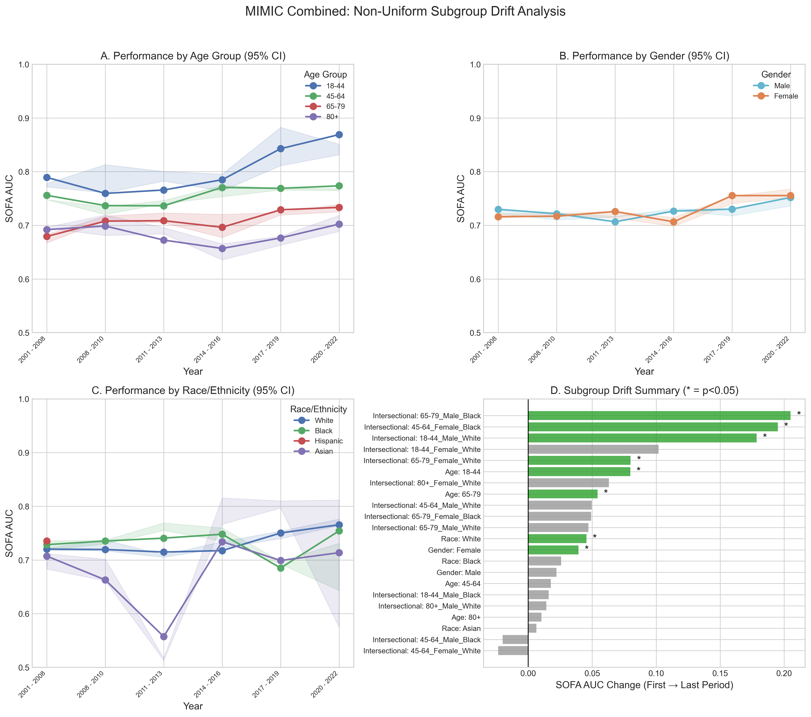
*Figure 1: MIMIC Combined - Non-uniform subgroup drift analysis over 21 years*

**Key Findings:**
- Race=Asian (APS-III): **+0.148** (p=0.008) - significant improvement
- Race=Asian (SAPS-II): **+0.129** (p=0.017) - significant improvement
- Age=18-44 (APS-III): **+0.092** (p<0.001) - significant improvement
- Age=18-44 (SOFA): **+0.080** (p=0.009) - significant improvement
- Overall trend: Younger patients and Asian patients show strong improvements

---

### Figure 2: eICU Combined (US, 2014-2021)

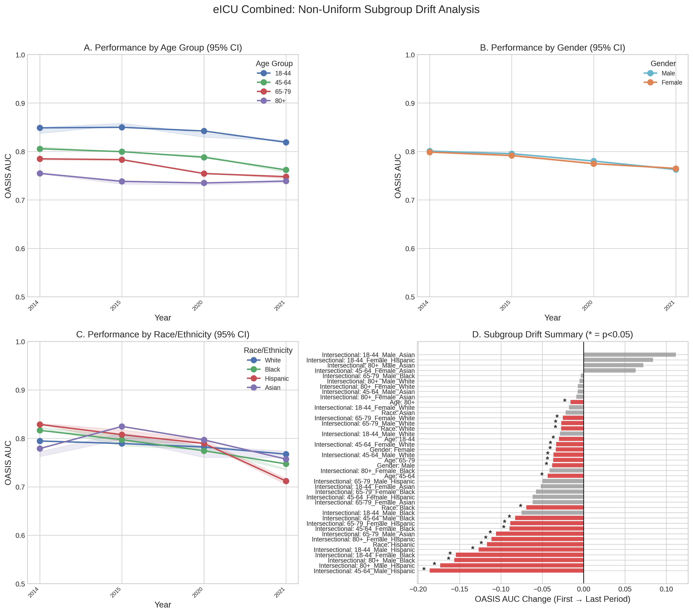
*Figure 2: eICU Combined - Non-uniform subgroup drift analysis over 7 years*

**Key Findings:**
- Race=Asian (SOFA): **+0.101** (p<0.001) - significant improvement
- Age=80+ (SOFA): **+0.044** (p<0.001) - elderly improve
- Gender=Female (SOFA): **+0.028** (p<0.001) - females improve
- Most subgroups show degradation in APS-III scores
- 78.2% of comparisons are statistically significant

---

### Figure 3: Saltz (Netherlands, 2013-2021)

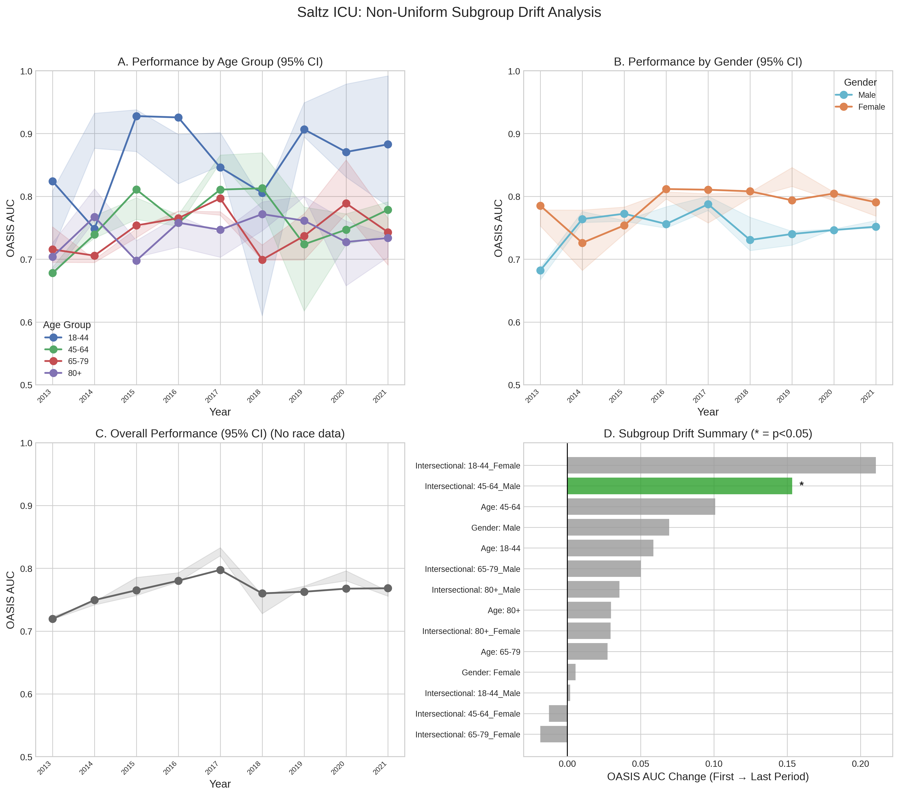
*Figure 3: Saltz (Netherlands) - Non-uniform subgroup drift analysis over 9 years*

**Key Findings:**
- Age=45-64 (APS-III): **+0.133** (p=0.024) - significant improvement
- Age=45-64 (SAPS-II): **+0.117** (p=0.047) - significant improvement
- Gender=Male (APS-III): **+0.092** (p=0.009) - males improve significantly
- Overall: Mostly stable with 17.9% significant comparisons
- European dataset shows different patterns than US datasets

---

### Figure 4: Zhejiang (China, 2011-2022)

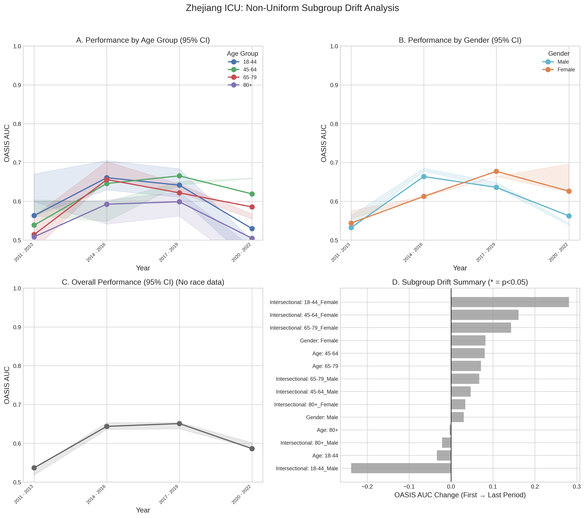
*Figure 4: Zhejiang (China) - Non-uniform subgroup drift analysis over 11 years*

**Key Findings:**
- Gender=Female (APS-III): **+0.158** (p=0.007) - females improve significantly
- Age=80+ (APS-III): **+0.141** (p=0.041) - elderly improve
- Age=45-64 (SAPS-II): **+0.136** (p=0.043) - middle-aged improve
- Overall: Mostly stable with 17.9% significant comparisons
- Asian dataset shows unique gender patterns (females improve 3x more than males)

---

### Figure 5: Summary (Key Findings)

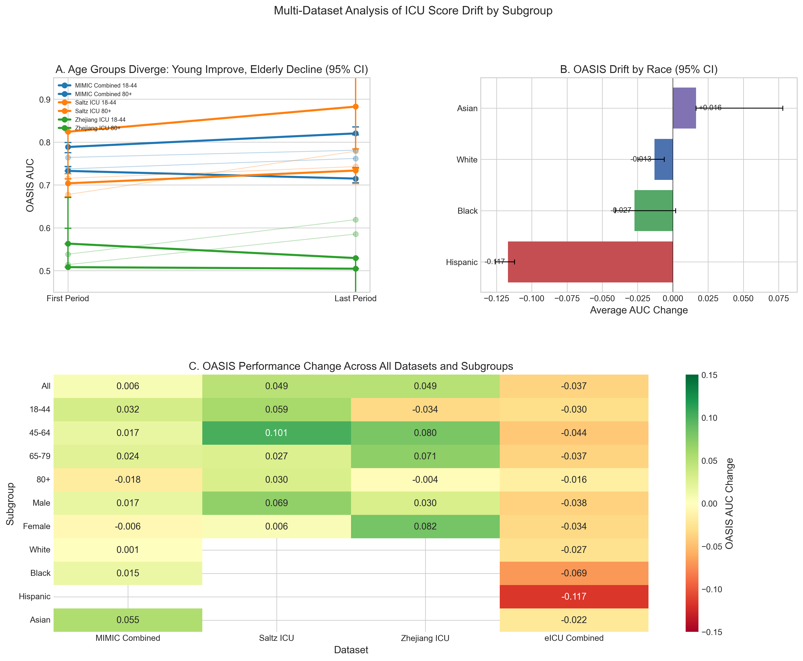
*Figure 5: Multi-panel summary showing (A) Age group divergence, (B) Race disparities, (C) Comprehensive heatmap*

---

## Clinical Implications

1. **Uniform recalibration is insufficient** - different subgroups need different adjustments
2. **Geographic context matters** - the same subgroup can experience opposite drift in different healthcare systems
3. **Age-specific models may be needed** - the consistent age divergence pattern suggests fundamental differences in how scores perform across age groups

---

## Project Structure

```
Data-Drift/
├── code/
│   ├── config.py                 # Dataset configurations & constants
│   ├── batch_analysis.py         # Multi-dataset drift analysis (main)
│   ├── supplementary_analysis.py # SOFA + care frequency analysis
│   ├── generate_all_figures.py   # Figure generation (fig1-5, figS1-S11)
│   ├── merge_mimic.py            # Merge MIMIC-III + MIMIC-IV
│   ├── merge_eicu.py             # Merge eICU-old + eICU-new
│   └── tests/                    # Statistical method validation
│       ├── test_bootstrap.py     # Bootstrap CI verification (5 tests)
│       └── test_delong.py        # DeLong's test verification (7 tests)
├── data/
│   ├── mimic_iii/                # MIMIC-III (27K patients, 2001-2008)
│   ├── mimic_iv_x/               # MIMIC-IV (85K patients, 2008-2022)
│   ├── mimic_iv_lc/              # MIMIC-IV subsets: mouthcare + mech. vent. (17K)
│   ├── mimic_combined/           # Merged MIMIC-III + MIMIC-IV (112K patients)
│   ├── eicu/                     # eICU-old (290K) + eICU-new (372K)
│   ├── eicu_combined/            # Merged eICU (661K patients)
│   ├── saltz/                    # Saltz (27K patients)
│   └── zhejiang/                 # Zhejiang Hospital, China (8K patients)
├── docs/
│   └── care_phenotypes.md        # Care phenotypes methodology documentation
├── figures/                      # Main figures (fig1-5: per-dataset analysis)
│   └── supplementary/            # Supplementary figures (figS1-S11)
├── output/                       # Analysis results (per-dataset)
│   ├── mimic_combined/           # MIMIC Combined results
│   ├── eicu_combined/            # eICU Combined results
│   ├── saltz/                    # Saltz results
│   ├── zhejiang/                 # Zhejiang results
│   ├── mimic_sofa_results.csv    # SOFA + care phenotype results
│   └── mimic_sofa_deltas.csv     # SOFA + care phenotype deltas
├── run_all.sh                    # Reproducibility script (Linux/macOS)
└── requirements.txt              # Python dependencies
```

---

## Methodology

### Analysis Approach: Per-Dataset Analysis

> **Important:** Each dataset is analyzed **independently**. We do NOT make cross-dataset statistical comparisons (e.g., "MIMIC drift is greater than Saltz drift"). Instead, we:
>
> 1. Analyze drift within each dataset using its own temporal bins
> 2. Report per-dataset results separately in `output/{dataset}/` directories
> 3. Visually compare patterns across datasets to identify **consistent themes** (e.g., age divergence appears in multiple regions)
>
> This approach respects the fundamental differences between datasets (patient populations, healthcare systems, data collection methods) while allowing us to identify recurring patterns of non-uniform drift.

### Severity Scores Analyzed

| Score | Components | Range |
|-------|------------|-------|
| **OASIS** | 10 variables (age, GCS, vitals, ventilation, etc.) | 0-47 |
| **SAPS-II** | 17 variables (age, vitals, labs, chronic conditions) | 0-163 |
| **APS-III** | 20 variables (similar to APACHE III) | 0-299 |
| **SOFA** | 6 organ systems (respiratory, cardiovascular, etc.) | 0-24 |
| **APACHE** | Acute physiology + chronic health evaluation | 0-299 |

### Score Availability by Dataset

> **Note:** APACHE scores are only available in eICU datasets. APACHE is a proprietary scoring system primarily used in US multi-center ICU networks.

| Dataset | SOFA | OASIS | SAPS-II | APS-III | APACHE |
|---------|:----:|:-----:|:-------:|:-------:|:------:|
| MIMIC Combined | ✓ | ✓ | ✓ | ✓ | ✗ |
| eICU Combined | ✓ | ✓ | ✓ | ✓ | ✓ |
| Saltz | ✓ | ✓ | ✓ | ✓ | ✗ |
| Zhejiang | ✓ | ✓ | ✓ | ✓ | ✗ |

### Analysis Pipeline

1. **Data loading**: Standardize demographics across datasets
2. **Subgroup stratification**: Age (18-44, 45-64, 65-79, 80+), Gender, Race/Ethnicity
3. **AUC computation**: Score discrimination for mortality prediction per time period
4. **Drift quantification**: Delta AUC between first and last time periods
5. **Statistical testing**: DeLong's test for significance of AUC differences

### Statistical Methods

| Method | Purpose | Implementation |
|--------|---------|----------------|
| **Bootstrap CIs** | Confidence intervals for AUC | Percentile method, stratified resampling (n=100-1000) |
| **DeLong's test** | Compare AUCs between time periods | Hanley-McNeil variance approximation, two-tailed z-test |
| **Significance** | Identify reliable drift | p < 0.05 (DeLong's test) or 95% CI excludes 0 |

#### What Does DeLong's Test Tell You?

DeLong's test answers: **"Is the observed AUC change real, or just random noise?"**

- **p < 0.05** → The drift is statistically significant (unlikely due to chance)
- **p ≥ 0.05** → The drift could be random variation (insufficient evidence)

**Example interpretation from our results:**

| Finding | Δ AUC | p-value | Meaning |
|---------|-------|---------|---------|
| MIMIC Combined Asian APS-III | +0.148 | 0.008 | **Real improvement** — only 0.8% chance this is random |
| Saltz Overall SOFA | +0.034 | 0.28 | **Not significant** — 28% chance this is just noise |

---

## Outputs

**Per-Dataset Results (batch_analysis.py):**

Each dataset gets its own output directory with self-contained analysis results:

```
output/{dataset}/
├── drift_results.csv      # Per-period AUC values with 95% CIs
├── drift_deltas.csv       # Drift deltas with p-values (DeLong's test)
├── summary_by_score.csv   # Overall drift summary by score
└── subgroup_drift.csv     # Subgroup-specific drift analysis
```

| Dataset Directory | Description |
|-------------------|-------------|
| `output/mimic_combined/` | MIMIC Combined (2001-2022) - 21-year continuous analysis |
| `output/eicu_combined/` | eICU Combined (2014-2021) - 7-year temporal analysis |
| `output/saltz/` | Saltz (2013-2021) - European dataset |
| `output/zhejiang/` | Zhejiang (2011-2022) - Asian dataset |

**Figures (generate_all_figures.py + supplementary_analysis.py):**

| File | Description |
|------|-------------|
| `figures/fig1_mimic_combined.png` | MIMIC Combined per-dataset analysis |
| `figures/fig2_eicu_combined.png` | eICU Combined per-dataset analysis |
| `figures/fig3_saltz.png` | Saltz per-dataset analysis |
| `figures/fig4_zhejiang.png` | Zhejiang per-dataset analysis |
| `figures/fig5_money_figure.png` | Summary figure (key findings) |
| `figures/supplementary/figS1-S11*.png` | Care phenotypes + cross-dataset comparisons |

---

## Supplementary Analysis

### Care Phenotypes: A Novel Proxy for Intersectional Demographics

Care phenotypes represent a novel approach using **nursing care intensity patterns** as a proxy for unmeasured intersectional factors (socioeconomic status, insurance, language barriers). See [Care Phenotypes Documentation](docs/care_phenotypes.md) for details.

**Key insight:** Patients with low care frequency (Q4) may represent a disadvantaged phenotype that experiences worse score calibration.

---

### Supplementary Figures

#### MIMIC-IV SOFA + Care Phenotypes (S1-S2)

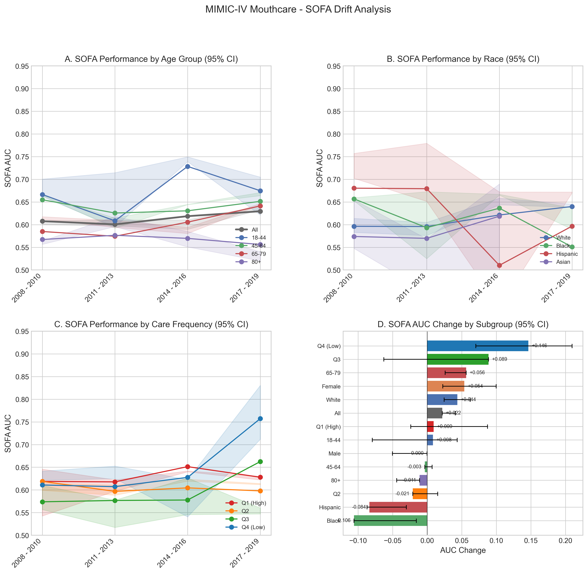
*Figure S1: MIMIC-IV Mouthcare cohort (N=8,675) - SOFA drift by age, race, gender, and care frequency*

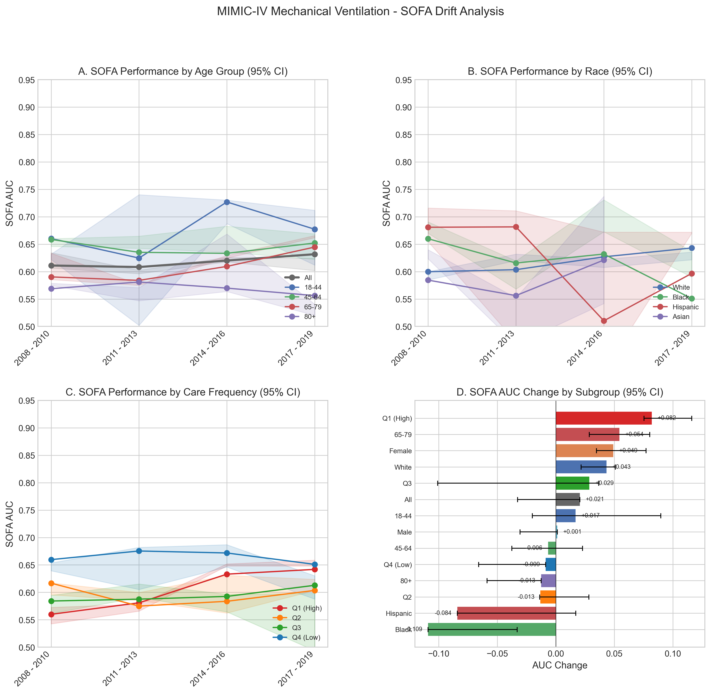
*Figure S2: MIMIC-IV Mechanical Ventilation cohort (N=8,919) - SOFA drift by age, race, gender, and care frequency*

---

#### Cross-Dataset Comparisons (S3-S11)

> **Note:** The following figures show cross-dataset comparisons. While visually informative for identifying patterns, the main analysis focuses on per-dataset findings (Figures 1-4 above).

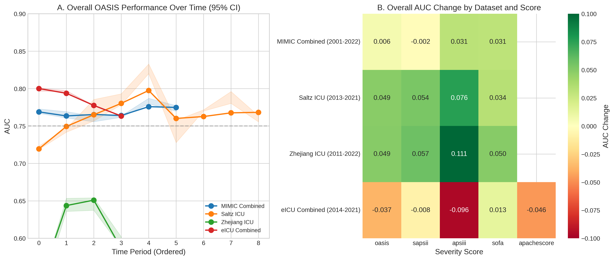
*Figure S3: Overall score performance trends (cross-dataset comparison)*

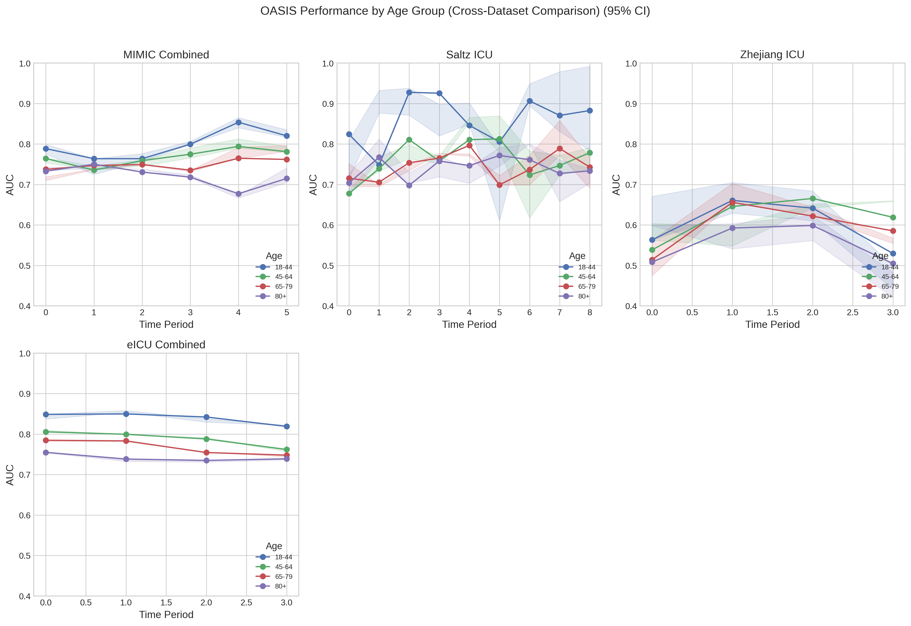
*Figure S4: Age-stratified drift comparison across all datasets*

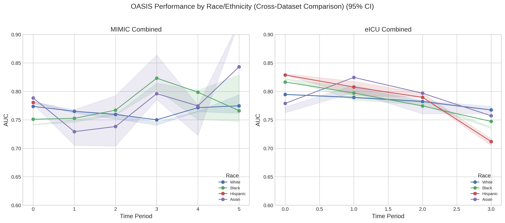
*Figure S5: Race/ethnicity disparities comparison across US datasets*

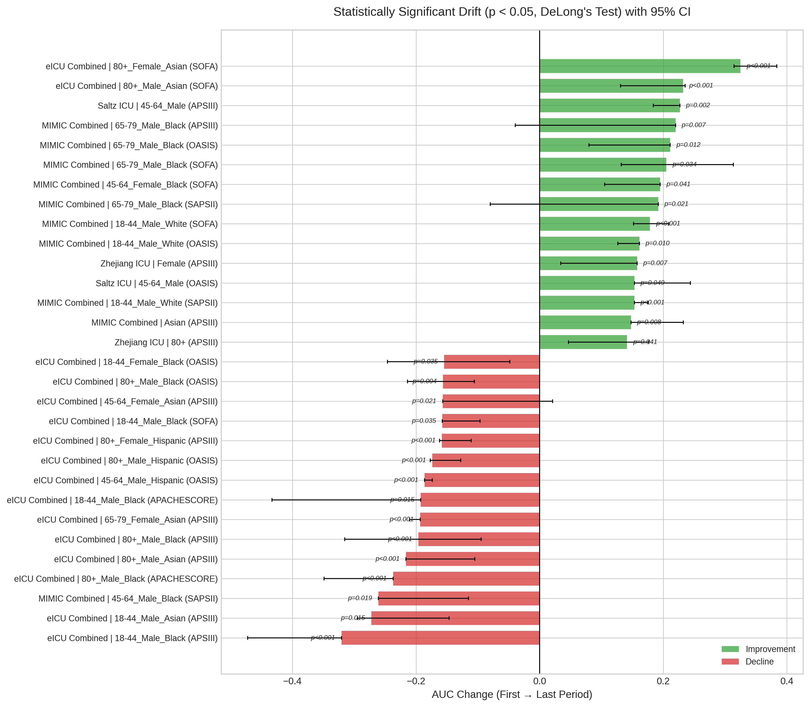
*Figure S6: Forest plot of statistically significant drift findings (p < 0.05) with confidence intervals*

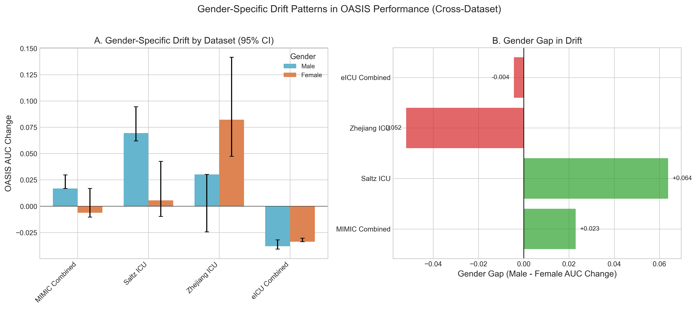
*Figure S7: Gender-specific drift patterns across datasets*

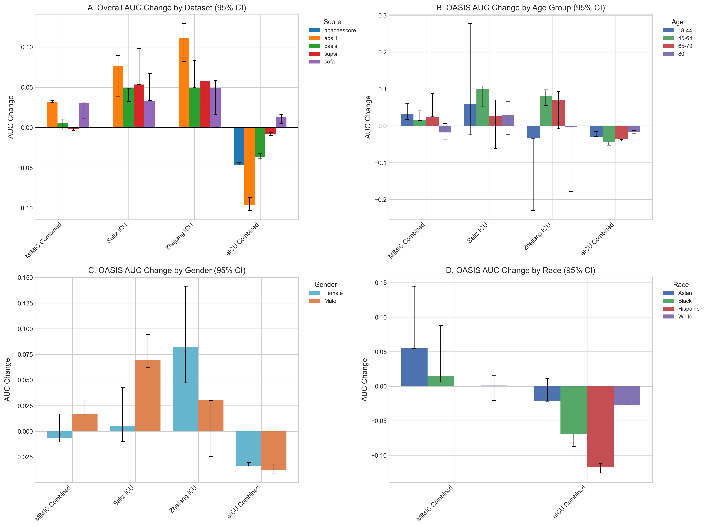
*Figure S8: Summary of drift deltas by subgroup type (cross-dataset)*

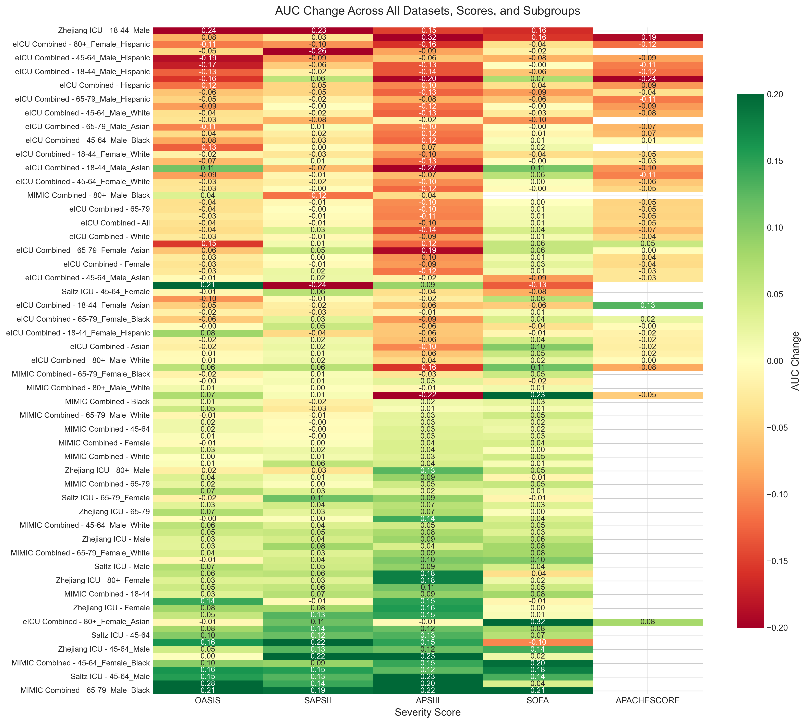
*Figure S9: Comprehensive drift heatmap showing all datasets, subgroups, and scores*


*Figure S10: Drift patterns by age group across all severity scores*

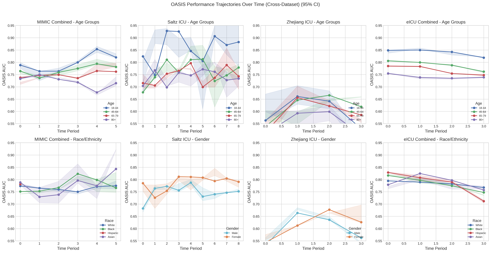
*Figure S11: Full temporal trajectories showing how subgroups diverge over multiple time periods*

---

#### COVID-19 Era Analysis (eICU Combined 2020-2021)

> **Note:** This analysis is specific to eICU Combined which includes data from the COVID-19 pandemic period (2020-2021).

**Racial/Ethnic Disparities during COVID-19 Era:**

| Subgroup | OASIS Δ | SOFA Δ | APS-III Δ | APACHE Δ |
|----------|---------|--------|-----------|----------|
| Hispanic | **-0.117*** | **-0.039*** | **-0.104*** | **-0.092*** |
| Black | **-0.069*** | -0.002 | **-0.125*** | **-0.030*** |
| Asian | -0.022 | **+0.101*** | **-0.104*** | -0.021 |
| White | **-0.027*** | **+0.012*** | **-0.091*** | **-0.045*** |

*The COVID-era eICU data (2020-2021) shows pervasive score degradation (78% of comparisons significant), with Hispanic and Black patients experiencing the largest declines in several scores.*

**Gender Differences during COVID-19 Era:**

| Region | Dataset | Male (OASIS) | Female (OASIS) | Pattern |
|--------|---------|--------------|----------------|---------|
| Europe | Saltz | +0.069 | +0.006 | Males improve 10x more |
| Asia | Zhejiang | +0.030 | +0.082 | Females improve 3x more |
| US | MIMIC Combined | +0.017 | -0.006 | Males improve, females decline |
| US | eICU Combined | **-0.038*** | **-0.034*** | Both decline significantly |


## Next Steps

### Immediate Priorities

- [ ] **Calibration analysis**: Assess calibration drift (Brier score, calibration curves) alongside discrimination
- [ ] **Intersectional analysis**: Examine combinations (e.g., elderly Hispanic patients) for compounded disparities
- [ ] **Care phenotype expansion**: Apply care phenotype methodology to additional datasets and nursing interventions

### Extended Analysis

- [ ] **Recalibration strategies**: Test subgroup-specific recalibration approaches (not uniform!)
- [ ] **Feature importance**: Identify which score components drive subgroup-specific drift
- [ ] **External validation**: Apply findings to additional datasets (ANZICS, UK ICU)
- [ ] **Temporal granularity**: Monthly/quarterly drift analysis for datasets with sufficient data

### Clinical Translation

- [ ] **Decision threshold analysis**: How drift affects clinical decisions at specific score cutoffs
- [ ] **Fairness metrics**: Compute equalized odds, demographic parity across subgroups
- [ ] **Intervention simulation**: Model impact of periodic recalibration on patient outcomes
- [ ] **Clinical guidelines**: Recommendations for score interpretation by subgroup

---

## Citation

```bibtex
@software{data_drift_2025,
  title={Subgroup-Specific Drift in ICU Severity Scores},
  author={Hamza, Nabulsi and Liu, Xiaoli and Celi, Leo Anthony and Cajas, Sebastian},
  year={2025}
}
```

---

## License

[CC BY-NC-SA 4.0](https://creativecommons.org/licenses/by-nc-sa/4.0/)
