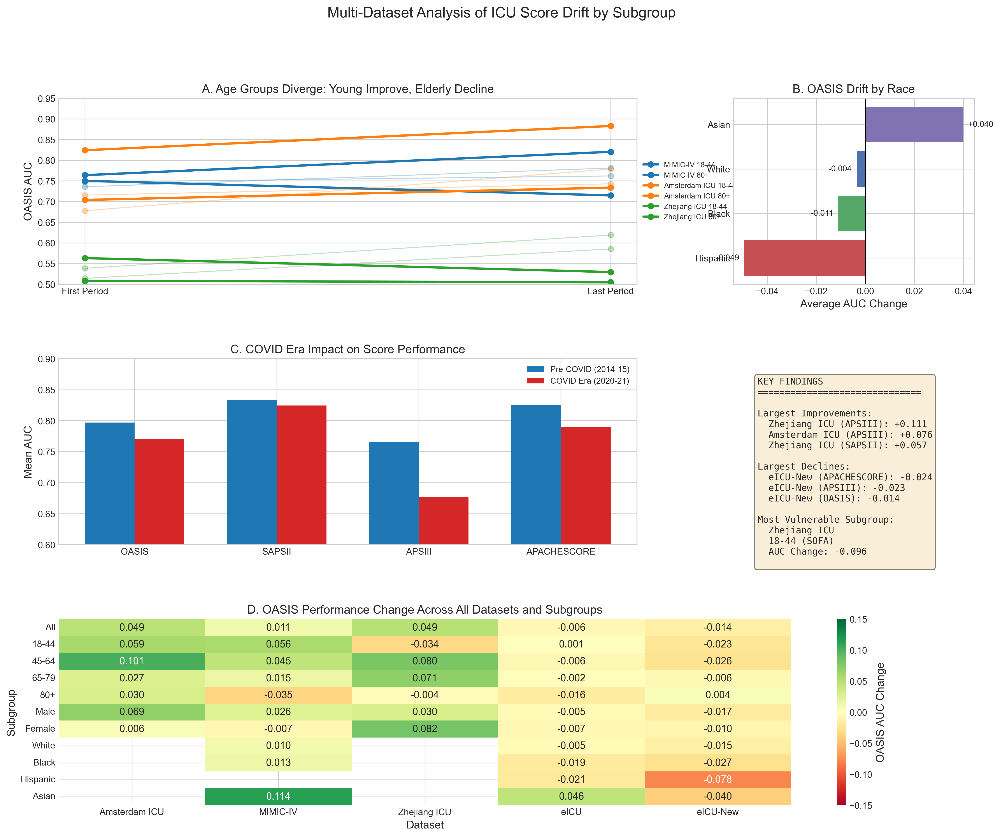
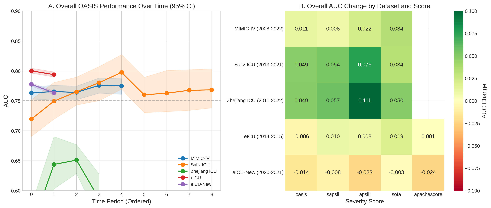
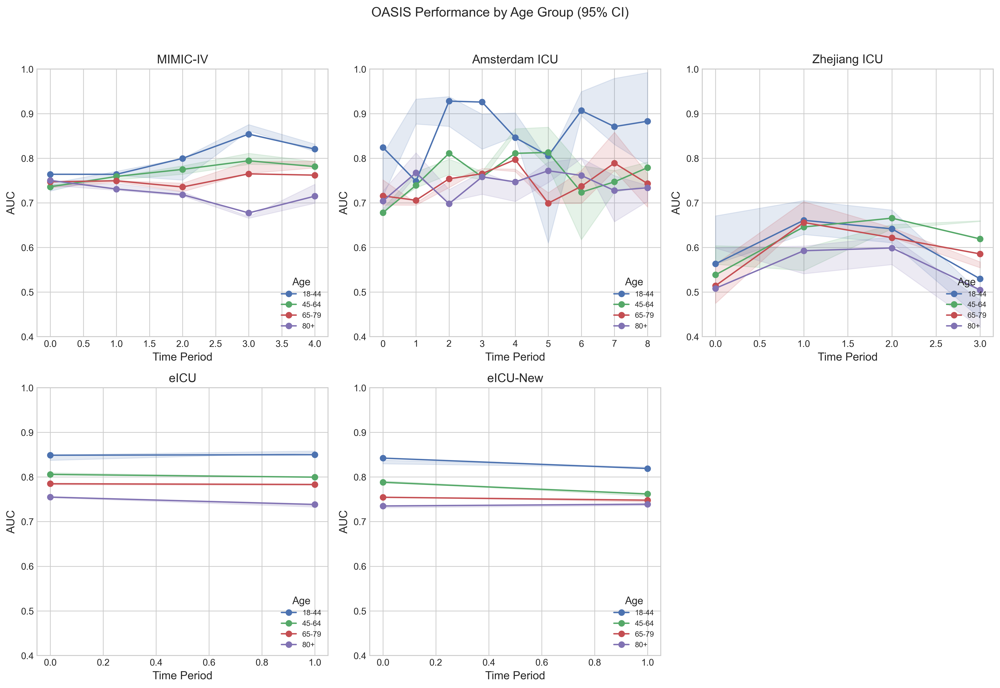
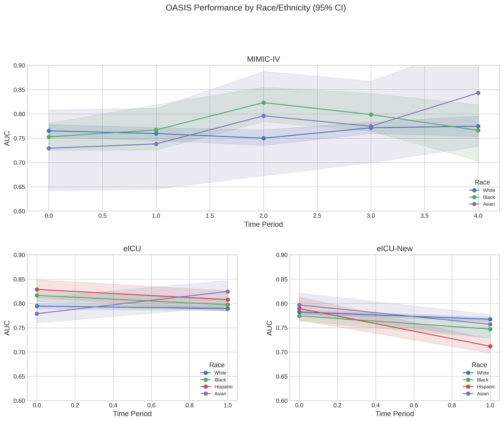
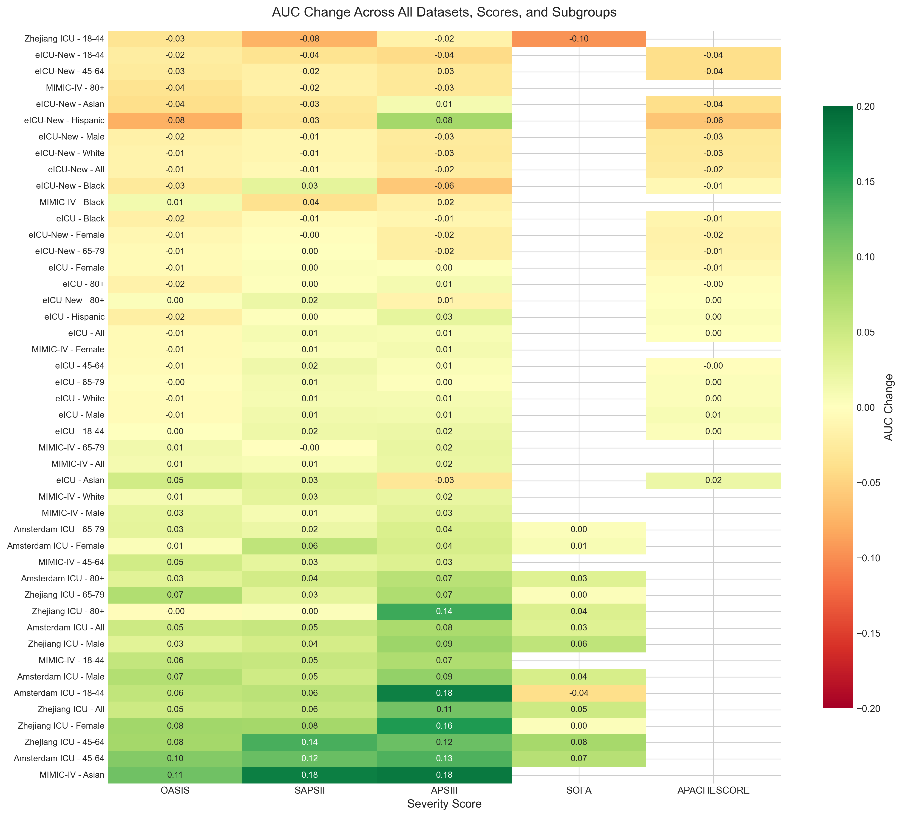
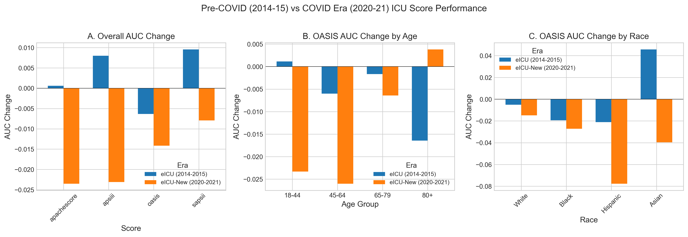

# Subgroup-Specific Drift in ICU Severity Scores

[](https://creativecommons.org/licenses/by-nc-sa/4.0/)
[](https://github.com/sebasmos/Data-Drift)

> **TL;DR:** ICU severity scores (OASIS, SAPS-II, APS-III, SOFA) drift differently across demographic subgroups. We analyze 826,611 ICU admissions across 6 primary + 2 supplementary datasets from the US, Europe, and Asia (2001-2022) to quantify these disparities.

---

## Quick Start

### Requirements
- Python 3.10+
- [uv](https://github.com/astral-sh/uv) package manager (`pip install uv`)

### Linux/macOS
```bash
# Setup environment
uv venv
source .venv/bin/activate
uv pip install -r requirements.txt

# Run full pipeline (see Bootstrap Configuration below)
./run_all.sh --fast       # Fast testing (~1 min)
./run_all.sh              # Default (~15 min)
./run_all.sh -b 1000      # Production (~2-4 hours)

# Or run individual steps
./run_all.sh --setup      # Only setup environment
./run_all.sh --analysis   # Only run analysis
./run_all.sh --figures    # Only generate figures
```

### Windows (PowerShell)
```powershell
# Setup environment
uv venv
.venv\Scripts\activate
uv pip install -r requirements.txt

# Run analysis (see Bootstrap Configuration below)
python code/batch_analysis.py --fast        # Fast testing (~1 min)
python code/batch_analysis.py               # Default (~15 min)
python code/batch_analysis.py -b 1000       # Production (~2-4 hours)

python code/supplementary_analysis.py --fast
python code/generate_all_figures.py

# Or use Git Bash to run the shell script
bash run_all.sh --fast
```

### Bootstrap Configuration

The analysis computes bootstrap confidence intervals for AUC values. The number of bootstrap iterations (`N_BOOTSTRAP`) controls:
- **Accuracy**: More iterations = more accurate confidence intervals
- **Runtime**: More iterations = longer runtime

| Mode | Iterations | Runtime (all datasets) | Use Case |
|------|------------|------------------------|----------|
| `--fast` | 2 | ~1 minute | Testing, debugging |
| Default | 100 | ~15 minutes | Development |
| `-b 1000` | 1000 | ~2-4 hours | Production, publication |

```bash
# Examples
python code/batch_analysis.py --fast           # 2 iterations
python code/batch_analysis.py                  # 100 iterations (default)
python code/batch_analysis.py --bootstrap 500  # 500 iterations
python code/batch_analysis.py -b 1000          # 1000 iterations
```

---

## Results

### Datasets Analyzed

**Primary Datasets:**

| Dataset | N | Period | Mortality | Scores | Race | Source |
|---------|---|--------|-----------|--------|------|--------|
| MIMIC-III | 27,226 | 2001-2008 | ~12% | **SOFA**, OASIS, SAPS-II, APS-III | Yes | US (Boston) |
| MIMIC-IV | 85,242 | 2008-2022 | 10.9% | **SOFA**, OASIS, SAPS-II, APS-III | Yes | US (Boston) |
| eICU | 289,503 | 2014-2015 | 8.7% | **SOFA**, OASIS, SAPS-II, APS-III, APACHE | Yes | US (Multi-center) |
| eICU-New | 371,855 | 2020-2021 | 12.7% | **SOFA**, OASIS, SAPS-II, APS-III, APACHE | Yes | US (Multi-center) |
| Saltz | 27,259 | 2013-2021 | 7.9% | **SOFA**, OASIS, SAPS-II, APS-III | No | Europe (Netherlands) |
| Zhejiang | 7,932 | 2011-2022 | 14.7% | **SOFA**, OASIS, SAPS-II, APS-III | No | Asia (China) |

**MIMIC-IV Subsets (with SOFA + care frequency):**

| Dataset | N | Period | Mortality | Scores | Race | Analysis Focus |
|---------|---|--------|-----------|--------|------|----------------|
| MIMIC-IV Mouthcare | 8,675 | 2008-2019 | ~30% | **SOFA** | Yes | Oral care frequency |
| MIMIC-IV Mech. Vent. | 8,919 | 2008-2019 | ~30% | **SOFA** | Yes | Turning frequency |

**Total: 826,611 ICU admissions across 8 datasets**

### Overall Drift by Dataset

| Dataset | SOFA | OASIS | SAPS-II | APS-III | Direction |
|---------|------|-------|---------|---------|-----------|
| MIMIC-III | - | - | - | - | *Baseline (single period)* |
| MIMIC-IV | **+0.034** | +0.011 | +0.008 | +0.022 | Improving |
| Saltz | **+0.034** | +0.049 | +0.054 | +0.076 | Improving |
| Zhejiang | **+0.050** | +0.049 | +0.057 | +0.111 | Improving |
| eICU | **+0.019** | -0.006 | +0.010 | +0.008 | Stable |
| eICU-New | -0.003 | -0.014 | -0.008 | -0.023 | Declining |

*MIMIC-III serves as historical baseline (2001-2008, single period - no drift analysis possible)*
*SOFA available for all datasets*

### Subgroup-Specific OASIS Drift

| Subgroup | MIMIC-IV | Saltz | Zhejiang | eICU | eICU-New |
|----------|----------|-----------|----------|------|----------|
| **Age 18-44** | +0.056 | +0.059 | -0.034 | +0.001 | -0.023 |
| **Age 80+** | -0.035 | +0.030 | -0.004 | -0.016 | +0.004 |
| **Male** | +0.026 | +0.069 | +0.030 | -0.005 | -0.017 |
| **Female** | -0.007 | +0.006 | +0.082 | -0.007 | -0.010 |
| **White** | +0.010 | - | - | -0.005 | -0.015 |
| **Black** | +0.013 | - | - | -0.019 | -0.027 |
| **Hispanic** | - | - | - | -0.021 | **-0.078** |
| **Asian** | **+0.114** | - | - | +0.046 | -0.040 |

### Subgroup-Specific SOFA Drift

| Subgroup | MIMIC-IV | Saltz | Zhejiang | eICU | eICU-New |
|----------|----------|-----------|----------|------|----------|
| **Overall** | +0.034 | +0.034 | +0.050 | +0.019 | -0.003 |
| **Age 18-44** | **+0.110** | -0.039 | **-0.096** | +0.021 | -0.051 |
| **Age 80+** | +0.004 | +0.034 | +0.037 | +0.015 | +0.023 |
| **Male** | +0.030 | +0.041 | +0.061 | +0.015 | -0.009 |
| **Female** | +0.038 | +0.009 | +0.004 | +0.023 | +0.006 |
| **White** | +0.046 | - | - | +0.017 | -0.003 |
| **Black** | +0.019 | - | - | +0.013 | -0.008 |
| **Hispanic** | - | - | - | +0.016 | **-0.059** |
| **Asian** | +0.051 | - | - | **+0.087** | +0.007 |

### Key Finding: Drift Does Not Affect Patients Uniformly

> **Core thesis:** Model drift affects demographic subgroups non-uniformly. This has critical implications for clinical decision-making and suggests that uniform recalibration strategies would fail to address subgroup-specific disparities.

#### Evidence of Non-Uniform Drift

**1. Age Group Divergence Across Regions**

Young and elderly patients experience opposite drift directions - and this pattern is consistent across countries:

| Region | Dataset | Age 18-44 (SOFA) | Age 80+ (SOFA) | Pattern |
|--------|---------|------------------|----------------|---------|
| **US (Boston)** | MIMIC-IV | **+0.110** | +0.004 | Young improve far more |
| **Europe (Netherlands)** | Saltz | -0.039 | +0.034 | Young decline, elderly improve |
| **Asia (China)** | Zhejiang | **-0.096** | +0.037 | Young decline, elderly improve |
| **US (Multi-center)** | eICU | +0.021 | +0.015 | Both improve similarly |
| **US (COVID-era)** | eICU-New | -0.051 | +0.023 | Young decline, elderly improve |

*The age divergence pattern (young declining or stable while elderly improve) appears across US, European, and Asian datasets.*

**2. Racial/Ethnic Disparities (US Datasets)**

Hispanic patients show the most severe declines during the COVID era:

| Subgroup | eICU-New OASIS | eICU-New SOFA | Relative Impact |
|----------|----------------|---------------|-----------------|
| Hispanic | **-0.078** | **-0.059** | 5x worse than White |
| Black | -0.027 | -0.008 | 2x worse than White |
| White | -0.015 | -0.003 | Baseline |
| Asian | -0.040 | +0.007 | Mixed |

**3. Gender Differences Vary by Region**

| Region | Dataset | Male (OASIS) | Female (OASIS) | Pattern |
|--------|---------|--------------|----------------|---------|
| Europe | Saltz | +0.069 | +0.006 | Males improve 10x more |
| Asia | Zhejiang | +0.030 | +0.082 | Females improve 3x more |
| US | MIMIC-IV | +0.026 | -0.007 | Males improve, females decline |

**4. COVID-19 Amplified Existing Disparities**

Comparing eICU (2014-15) vs eICU-New (2020-21):
- Overall scores declined modestly (-0.003 to -0.023)
- Hispanic patients declined **dramatically** (-0.059 to -0.078)
- This suggests the pandemic disproportionately degraded score performance for vulnerable groups

#### Clinical Implications

1. **Uniform recalibration is insufficient** - different subgroups need different adjustments
2. **Vulnerable populations exist** - Hispanic and young patients in COVID-era data show worst degradation
3. **Geographic context matters** - the same subgroup can experience opposite drift in different healthcare systems
4. **Age-specific models may be needed** - the consistent age divergence pattern suggests fundamental differences in how scores perform across age groups

### Figures


*Figure 7: Multi-panel summary - (A) Age group divergence, (B) Race disparities, (C) COVID impact, (D) Cross-dataset heatmap*

<details>
<summary>Cross-Dataset Figures (fig1-6)</summary>


*Figure 1: Overall score performance trends*


*Figure 2: Age-stratified drift by dataset*


*Figure 3: Race/ethnicity disparities (US datasets)*


*Figure 4: AUC change summary by subgroup*


*Figure 5: Comprehensive drift heatmap*


*Figure 6: Pre-COVID vs COVID era comparison*

</details>

<details>
<summary>MIMIC-IV SOFA + Care Frequency Figures (figS1-S2)</summary>


*Figure S1: MIMIC-IV Mouthcare cohort (N=8,675) - SOFA drift by age, race, gender, and care frequency*


*Figure S2: MIMIC-IV Mechanical Ventilation cohort (N=8,919) - SOFA drift by age, race, gender, and care frequency*

</details>

---

## Project Structure

```
Data-Drift/
├── code/
│   ├── config.py                 # Dataset configurations
│   ├── batch_analysis.py         # Multi-dataset drift analysis
│   ├── supplementary_analysis.py # SOFA + care frequency analysis
│   └── generate_all_figures.py   # Figure generation
├── data/
│   ├── mimiciii/                 # MIMIC-III (27K patients, 2001-2008 baseline)
│   ├── mimiciv/                  # MIMIC-IV (85K patients)
│   ├── mimic/                    # MIMIC-IV subsets: mouthcare + mech. vent. (17K)
│   ├── eicu/                     # eICU + eICU-New (661K patients)
│   ├── saltz/                    # Saltz (27K patients)
│   └── zhejiang/                 # Zhejiang Hospital, China (8K patients)
├── figures/                      # Generated figures (fig1-7, figS1-S2)
├── output/                       # Analysis results (CSV tables)
├── run_all.sh                    # Reproducibility script
└── requirements.txt              # Python dependencies
```

---

## Methodology

### Severity Scores Analyzed

| Score | Components | Range |
|-------|------------|-------|
| **OASIS** | 10 variables (age, GCS, vitals, ventilation, etc.) | 0-47 |
| **SAPS-II** | 17 variables (age, vitals, labs, chronic conditions) | 0-163 |
| **APS-III** | 20 variables (similar to APACHE III) | 0-299 |
| **SOFA** | 6 organ systems (respiratory, cardiovascular, etc.) | 0-24 |
| **APACHE** | Acute physiology + chronic health evaluation | 0-299 |

### Score Availability by Dataset

> **Note:** APACHE scores are only available in eICU datasets. APACHE is a proprietary scoring system primarily used in US multi-center ICU networks. MIMIC (Boston), Saltz (Netherlands), and Zhejiang (China) hospitals do not routinely compute APACHE scores in their EHR systems.

| Dataset | SOFA | OASIS | SAPS-II | APS-III | APACHE |
|---------|:----:|:-----:|:-------:|:-------:|:------:|
| MIMIC-III | ✓ | ✓ | ✓ | ✓ | ✗ |
| MIMIC-IV | ✓ | ✓ | ✓ | ✓ | ✗ |
| eICU | ✓ | ✓ | ✓ | ✓ | ✓ |
| eICU-New | ✓ | ✓ | ✓ | ✓ | ✓ |
| Saltz | ✓ | ✓ | ✓ | ✓ | ✗ |
| Zhejiang | ✓ | ✓ | ✓ | ✓ | ✗ |

*Figures showing APACHE only display eICU and eICU-New data points.*

### Analysis Pipeline

1. **Data loading**: Standardize demographics across datasets
2. **Subgroup stratification**: Age (18-44, 45-64, 65-79, 80+), Gender, Race/Ethnicity
3. **AUC computation**: Score discrimination for mortality prediction per time period
4. **Drift quantification**: Delta AUC between first and last time periods

---

## Outputs

**Primary Analysis (batch_analysis.py):**
| File | Description |
|------|-------------|
| `output/all_datasets_drift_results.csv` | All 6 primary datasets, all scores (with 95% CIs) |
| `output/all_datasets_drift_deltas.csv` | Drift changes with confidence intervals |
| `output/table1_overall_drift.csv` | Overall drift by dataset and score |
| `output/table2_oasis_subgroup_drift.csv` | OASIS drift by subgroup |
| `output/table3_sample_sizes.csv` | Sample sizes |

**MIMIC-IV Subsets (supplementary_analysis.py):**
| File | Description |
|------|-------------|
| `output/mimic_sofa_results.csv` | SOFA results with care frequency |
| `output/mimic_sofa_deltas.csv` | SOFA drift deltas by subgroup |

**Figures (generate_all_figures.py + supplementary_analysis.py):**
| File | Description |
|------|-------------|
| `figures/fig1-7*.png` | Cross-dataset comparison (OASIS, SAPS-II, APS-III, SOFA) |
| `figures/figS1-S2*.png` | MIMIC-IV SOFA + care frequency analysis |

---

## Next Steps

### Immediate Priorities

- [ ] **Statistical testing**: Add confidence intervals and significance tests for drift comparisons
- [ ] **Calibration analysis**: Assess calibration drift (Brier score, calibration curves) alongside discrimination
- [ ] **Intersectional analysis**: Examine combinations (e.g., elderly Black females) for compounded disparities

### Extended Analysis

- [ ] **Recalibration strategies**: Test age-specific or era-specific recalibration approaches
- [ ] **Feature importance**: Identify which score components drive subgroup-specific drift
- [ ] **External validation**: Apply findings to additional datasets (ANZICS, UK ICU)

### Clinical Translation

- [ ] **Decision threshold analysis**: How drift affects clinical decision-making at specific thresholds
- [ ] **Fairness metrics**: Compute equalized odds, demographic parity across subgroups
- [ ] **Intervention simulation**: Model impact of periodic recalibration on patient outcomes

---

## Citation

```bibtex
@software{data_drift_2025,
  title={Subgroup-Specific Drift in ICU Severity Scores},
  author={Hamza, Nabulsi and Liu, Xiaoli and Celi, Leo Anthony and Cajas, Sebastian},
  year={2025},
  url={https://github.com/sebasmos/Data-Drift}
}
```

---

## License

[CC BY-NC-SA 4.0](https://creativecommons.org/licenses/by-nc-sa/4.0/)
