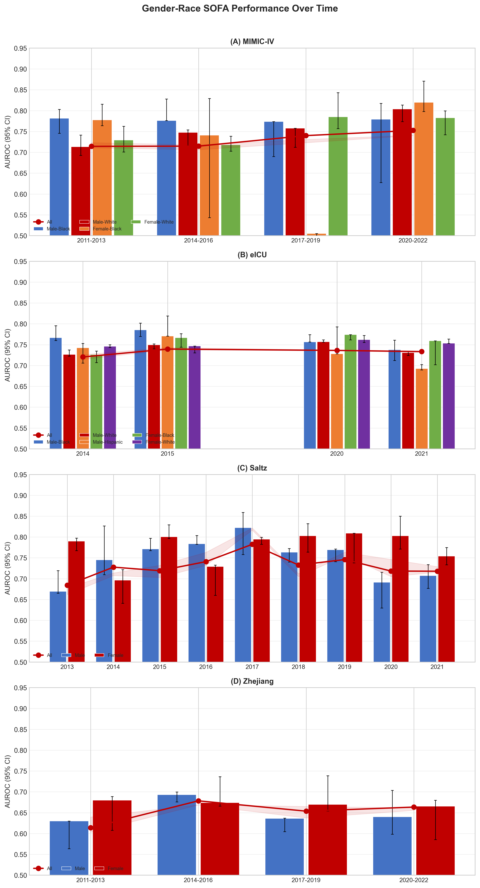
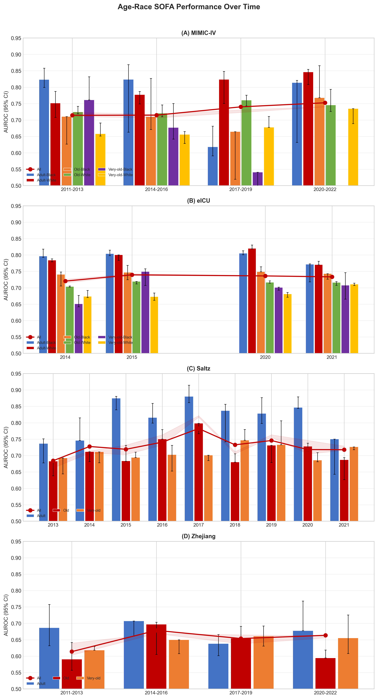
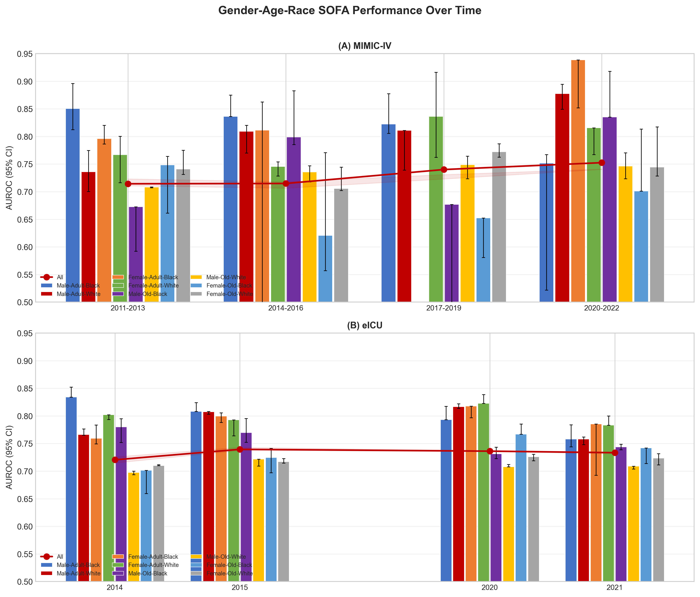
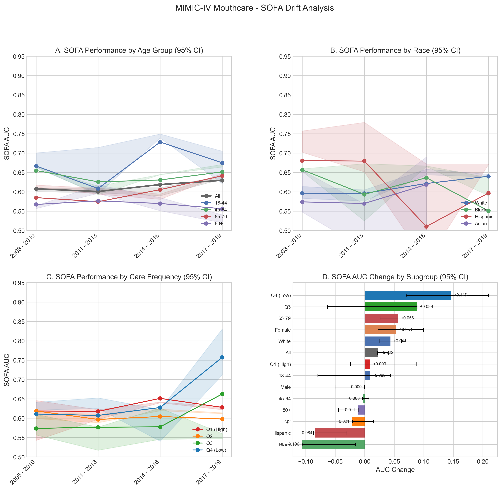
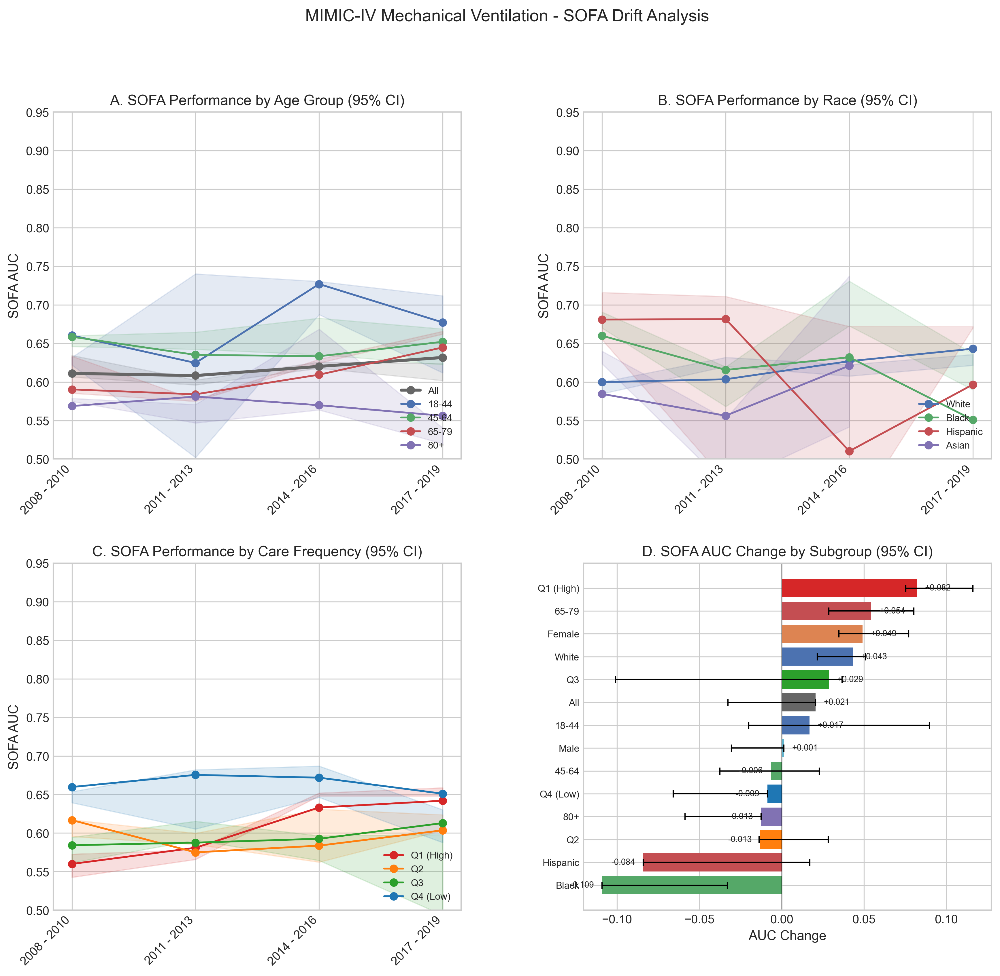

# Uniform Recalibration Is Unsafe: Subgroup-Specific Drift in ICU Severity Scores

[](https://creativecommons.org/licenses/by-nc-sa/4.0/)
[](https://github.com/sebasmos/Data-Drift)

> **A hospital that recalibrates SOFA based on aggregate trends will actively harm some patients while helping others.** This is not a theoretical concern -- it is a measurable, statistically robust, clinically significant pattern replicated across 809,017 ICU admissions on three continents. Uniform recalibration is unsafe.

---

## Table of Contents

1. [The Clinical Problem](#the-clinical-problem)
2. [Key Findings](#key-findings)
3. [Datasets](#datasets)
4. [Statistical Methods](#statistical-methods)
5. [SOFA Threshold Sensitivity](#sofa-threshold-sensitivity)
6. [The MIMIC vs eICU Divergence](#the-mimic-vs-eicu-divergence)
7. [Care Quartiles and Demographic Composition](#care-quartiles-and-demographic-composition)
8. [Volatility Indicators](#volatility-indicators)
9. [Figure Organization](#figure-organization)
10. [Output Files](#output-files)
11. [Reproducibility](#reproducibility)
12. [Requirements](#requirements)
13. [Citation](#citation)

---

## The Clinical Problem

ICU severity scores drift over time as patient populations, treatment protocols, and coding practices evolve. The standard response is periodic recalibration: fit a correction factor to recent data and apply it uniformly. **This assumes drift is uniform across patient subgroups. It is not.**

When a hospital observes that SOFA discrimination improved by +0.013 overall last year, the natural conclusion is that SOFA is working better. But that aggregate number conceals a 0.482 AUROC spread between the best-performing and worst-performing intersectional groups. Young Black male patients are degrading by -0.157 while elderly Asian female patients improve by +0.325. A uniform recalibration applied to this population would push predictions in the wrong direction for the most vulnerable subgroup.

**The policy implication is concrete:** any recalibration strategy that does not account for subgroup-specific drift trajectories risks systematically worsening care for minority and intersectional populations.

---

## Key Findings

Across 809,017 ICU admissions from 4 datasets spanning the US, Europe, and Asia (2001--2022):

1. **Uniform recalibration is unsafe.** Overall SOFA improvement (+0.013 in eICU) masks clinically significant degradation in specific subgroups. 18--44 Male Black patients degrade by -0.157 (p < 0.001) -- a 0.482 AUROC spread between best and worst intersectional groups. A hospital applying the aggregate correction would actively worsen predictions for this population.

2. **Between-group differences are not just detectable -- they are clinically meaningful.** Hispanic SOFA drift is significantly worse than White drift (delta = -0.051, pooled FDR p < 0.001), exceeding the 0.05 AUROC minimum clinically significant effect size. 85--91% of between-group comparisons pass both the statistical and clinical significance thresholds.

3. **Age groups drift in opposite directions** -- young patients degrade while elderly patients improve. This pattern replicates across US, European, and Asian healthcare systems, ruling out institution-specific explanations.

4. **The same subgroup can improve in one system and decline in another.** MIMIC Black patients improve over time while eICU Black patients degrade -- a divergence driven by heterogeneous practice patterns across hundreds of US hospitals versus a single academic center. No single recalibration factor generalizes.

---

## Datasets

| Dataset | N | Period | Mortality | Scores | Race Data | Source |
|---------|---|--------|-----------|--------|-----------|--------|
| MIMIC Combined | 112,468 | 2001--2022 | 11.1% | SOFA, OASIS, SAPS-II, APS-III | Yes | US (Boston, single-center) |
| eICU Combined | 661,358 | 2014--2021 | 10.9% | SOFA, OASIS, SAPS-II, APS-III, APACHE | Yes | US (multi-center, 4 regions) |
| Saltz | 27,259 | 2013--2021 | 7.9% | SOFA, OASIS, SAPS-II, APS-III | No | Europe (Netherlands) |
| Zhejiang | 7,932 | 2011--2022 | 14.7% | SOFA, OASIS, SAPS-II, APS-III | No | Asia (China) |

**Total: 809,017 ICU admissions.** Each dataset is analyzed independently. SOFA is the primary metric. Intersectional groupings follow a clean hierarchy: gender-race, age-race, age-gender-race. Single-subgroup analyses (age-only, gender-only, race-only) appear in supplementary materials only.

---

## Statistical Methods

| Method | Purpose |
|--------|---------|
| **Bootstrap CIs** | Percentile-method 95% confidence intervals for AUROC, with stratified resampling (n = 100--1000) |
| **Bootstrap independence** | First half of replicates reserved for trend tests, second half for between-group comparisons -- eliminates reuse-driven significance inflation |
| **Page's L trend test** | Detects monotonic AUROC trends across all ordered time periods, not just endpoints |
| **Between-group comparison** | Mann-Whitney U on independent bootstrap delta distributions tests whether one subgroup's drift differs from another's |
| **Pooled FDR correction** | Benjamini-Hochberg applied once across all scores simultaneously, reflecting the unified claim that drift is non-uniform |
| **Minimum clinically significant effect size** | Between-group differences must exceed 0.05 AUROC to be labeled clinically significant, based on published minimally important differences for critical care prediction models |

A finding is reported as **clinically significant** only when it is both statistically significant (pooled FDR p < 0.05) and exceeds the minimum effect size threshold.

---

## SOFA Threshold Sensitivity

Multiple SOFA binarization thresholds (2, 6, 8, 10) are tested to confirm that drift patterns and fairness findings are robust to threshold choice. Per-threshold results are saved separately as `drift_deltas_sofa{T}.csv` in each dataset's output directory.

---

## The MIMIC vs eICU Divergence

MIMIC Black patients improve over time while eICU Black patients degrade. This is not contradictory -- it is the core evidence that uniform recalibration is dangerous. MIMIC represents a single academic center (Beth Israel Deaconess, Boston) where institutional quality improvement may lift all subgroups. eICU aggregates hundreds of hospitals across the US with vastly different practice patterns, resources, and patient populations.

The eICU regional breakdown (Midwest, Northeast, South, West) and teaching-status stratification (teaching vs non-teaching) test whether this degradation is concentrated in specific regions or hospital types, or reflects a systemic pattern. If a hospital in the South shows different Black patient drift than one in the Northeast, a uniform national recalibration is doubly unsafe. Results are saved per-dataset to `regional_breakdown.csv`.

---

## Care Quartiles and Demographic Composition

Are care intensity differences an independent source of drift, or a proxy for demographic disparities? The care-demographics correlation analysis cross-tabulates care frequency quartiles with age, gender, race, and their intersections. Chi-squared tests and Cramer's V quantify the strength of association. If care quartile strongly correlates with race, then care-mediated drift is not independent of demographic drift -- they are measuring the same disparity through different lenses. Results are saved to `care_demographics_correlation.csv` (MIMIC only, where care data is available).

---

## Volatility Indicators

Simple first-to-last AUROC deltas can obscure unstable trajectories. Three volatility metrics characterize drift dynamics:

- **Coefficient of variation (CV):** Normalized spread of AUROC across time periods
- **Max drawdown:** Largest peak-to-trough AUROC decline
- **Trend reversal count:** Number of direction changes in the AUROC trajectory

Results are saved to `volatility_indicators.csv`.

---

## Figure Organization

Each dataset is analyzed and presented independently. Main figures use Xiaoli's recommended bar chart format: grouped bars with 95% CI error bars, "All" population as red line overlay, intersectional groupings only.

### Main Figures

#### Figure 1: Gender-Race SOFA Performance

Panels: (A) MIMIC-IV, (B) eICU, (C) Saltz, (D) Zhejiang. Groups: Male-Black, Male-White, Female-Black, Female-White (where race data available; gender-only for Saltz/Zhejiang).



#### Figure 2: Age-Race SOFA Performance

Panels: (A) MIMIC-IV, (B) eICU, (C) Saltz, (D) Zhejiang. Groups: Adult-Black, Adult-White, Old-Black, Old-White, Very-old-Black, Very-old-White (age-only for Saltz/Zhejiang).



#### Figure 3: Gender-Age-Race SOFA Performance

Panels: (A) MIMIC-IV, (B) eICU. Three-way intersectional groups (Male-Adult-Black, Female-Old-White, etc.). Only datasets with race data.



### Supplementary: Per-Dataset Detailed Analysis

<details>
<summary>Click to expand per-dataset figures</summary>

#### Per-Dataset Intersectional Analysis


#### Per-Dataset Calibration, Fairness, VA CAN Drift


</details>

### Supplementary: Care Phenotypes (MIMIC only)

<details>
<summary>Click to expand</summary>




#### Care Phenotype Demographics (L6)


</details>

### Supplementary: Single-Subgroup Analyses (per dataset)

<details>
<summary>Click to expand</summary>

#### MIMIC


#### eICU


#### Saltz


#### Zhejiang


</details>

---

## Output Files

Each dataset produces the following in `output/{dataset}/`:

| File | Description |
|------|-------------|
| `drift_results.csv` | Per-period AUROC with 95% CIs |
| `drift_deltas.csv` | Page's L trend test results (pooled FDR-corrected) |
| `between_group_comparisons.csv` | Between-group drift tests with effect sizes and CIs |
| `summary_by_score.csv` | Overall summary across all scores |
| `subgroup_drift.csv` | Subgroup-level drift results |
| `volatility_indicators.csv` | CV, max drawdown, trend reversal count |
| `care_demographics_correlation.csv` | Care quartile by demographic intersection cross-tabulation |
| `regional_breakdown.csv` | eICU regional and teaching-status stratification |
| `drift_deltas_sofa{T}.csv` | Per-threshold drift results (T = 2, 6, 8, 10) |

---

## Reproducibility

**Requirements:** Python 3.10+, [uv](https://github.com/astral-sh/uv) (`pip install uv`), dataset CSVs in `data/`

```bash
# Setup
uv venv && source .venv/bin/activate && uv pip install -r requirements.txt

# Run full pipeline
./run_all.sh --fast       # Fast testing (~1 min, 2 bootstrap iterations)
./run_all.sh              # Default (~15 min, 100 iterations)
./run_all.sh -b 1000      # Production (~2-4 hours, 1000 iterations)

# Individual steps
./run_all.sh --setup      # Only setup environment
./run_all.sh --analysis   # Only run analysis
./run_all.sh --figures    # Only generate figures
```

---

## Requirements

- Python 3.10+
- Dependencies listed in `requirements.txt`
- Dataset access: MIMIC (PhysioNet credentialed), eICU (PhysioNet credentialed), Saltz and Zhejiang (by arrangement with data owners)

---

## Citation

```bibtex
@software{data_drift_2025,
  title={Uniform Recalibration Is Unsafe: Subgroup-Specific Drift in ICU Severity Scores},
  author={Nabulsi, Hamza and Liu, Xiaoli and Celi, Leo Anthony and Cajas, Sebastian},
  year={2025}
}
```

## License

[CC BY-NC-SA 4.0](https://creativecommons.org/licenses/by-nc-sa/4.0/)
